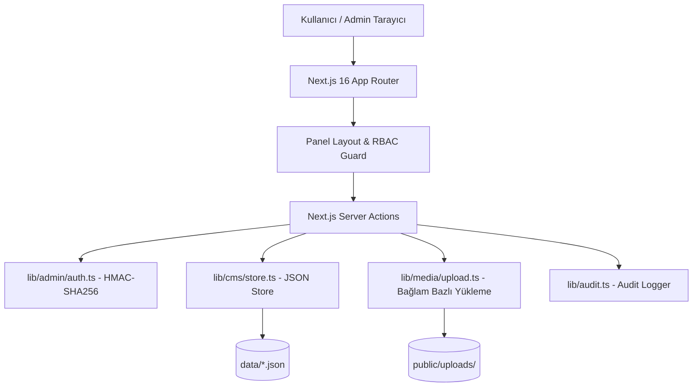

# Aden CMS - Mimari Dokümanı (Architecture)

## 1. Genel Bakış

Aden Bungalov CMS Yönetim Paneli, modern web standartlarında (2026), yüksek performanslı, bağımsız (standalone) çalışabilen ve dosya tabanlı atomik JSON veri deposuna sahip bir Next.js 16 (App Router) uygulamasıdır.



---

## 2. Temel Mimari Bileşenler

### 2.1 Veri Depolama Katmanı (`lib/cms/store.ts`)
* **Depolama**: Veriler `data/*.json` dosyalarında tutulur.
* **Atomik Yazma**: Yazma işlemleri önce geçici bir dosyaya (`.tmp`) yazılır ve ardından `fs.rename` ile atomik olarak değiştirilir. Bu sayede dosya bozulmaları engellenir.
* **Bellek Önbelleği (In-Process Cache)**: Dosya `mtime` kontrolü yapılarak okumalarda gereksiz disk I/O'su önlenir.
* **Önbellek Geçersiz Kılma**: İçerik değiştiğinde `revalidateSite()` çağrılarak public Next.js önbelleği yenilenir.

### 2.2 Kimlik Doğrulama & Oturum Yönetimi (`lib/admin/auth.ts`)
* **Oturum Token'ı**: `AUTH_SECRET` ile HMAC-SHA256 imzalı durumsuz (stateless) `aden_admin` httpOnly cookie.
* **Parola Güvenliği**: Parolalar `bcryptjs` ile salt'lanarak hash'lenir.
* **Sunucusuz / Veritabanısız Esneklik**: Dış bir veritabanı sunucusu bağımlılığı olmadan kalıcı diske sahip herhangi bir Node.js ortamında çalışır.

### 2.3 Medya Yükleme Engine (`lib/media/upload.ts`)
* Yüklenen dosyalar `public/uploads/` dizinine, **bağlamına göre klasörlenerek** kaydedilir:
  * Bungalov görselleri → `uploads/bungalov/{bungalov-id}/`
  * Galeri görselleri → `uploads/galeri/{kategori}/`
  * Slider görselleri/videoları → `uploads/slider/`
  * Neden Aden kart görselleri → `uploads/neden-aden/`
  * Logo, favicon vb. sistem görselleri → `uploads/` (kök)
* Klasör ve dosya adları path-traversal'a karşı güvenli hale getirilir (`safeSegment`).
* Ayrı bir medya kütüphanesi/kayıt dosyası tutulmaz; yüklenen dosyanın public URL'i doğrudan ilgili içeriğe (bungalov, galeri, slider vb.) kaydedilir.

---

## 3. Dizelleştirilmiş Klasör Yapısı

```
aden-website/
├── app/admin/              # Admin paneli route'ları
│   ├── (panel)/            # Korunan panel sayfaları (Dashboard, Website, Bungalovlar, Kullanıcılar, Aktivite, Yasal, Ayarlar)
│   ├── login/              # Giriş ekranı
│   └── actions.ts          # Global admin action'ları (logout)
├── components/admin/       # Admin paneli UI bileşenleri (Sidebar, Topbar, Listeler, Modallar)
├── data/                   # JSON Veri depolama dosyaları
├── docs/                   # Proje dokümantasyonu
├── lib/
│   ├── admin/              # Auth & session işlevleri
│   ├── cms/                # Store (readJson/writeJson)
│   ├── media/              # Bağlam bazlı dosya yükleme işleyici
│   ├── audit.ts            # Audit event kaydı
│   └── auth/rbac.ts        # Rol ve izin kataloğu
```
