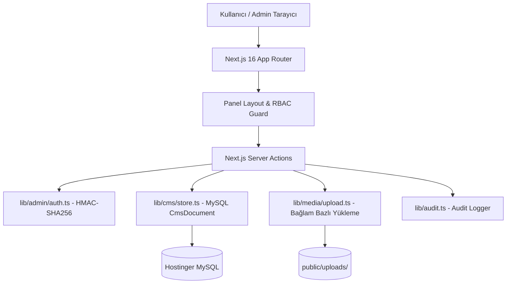

# Aden CMS - Mimari Dokümanı (Architecture)

## 1. Genel Bakış

Aden Bungalov CMS Yönetim Paneli, modern web standartlarında (2026), yüksek performanslı, bağımsız (standalone) çalışabilen ve **MySQL** üzerinde kalıcı veri deposuna sahip bir Next.js 16 (App Router) uygulamasıdır.



---

## 2. Temel Mimari Bileşenler

### 2.1 Veri Depolama Katmanı (`lib/cms/store.ts`)
* **Depolama**: Kaynak gerçeği MySQL `cms_documents` (dosya anahtarı + JSON payload + version).
* **Normalize tablolar**: Yazma sonrası `lib/cms/sync-normalized.ts` ile admin, bungalov, SEO, menü, FAQ vb. tablolar senkronlanır.
* **Atomik Yazma**: Prisma transaction (document + sync).
* **Bellek Önbelleği**: document `version` ile süreç-içi cache.
* **Yedek**: `data/*.json` yalnızca seed/bootstrap; `npm run db:export` ile DB→JSON dump.
* **Önbellek Geçersiz Kılma**: İçerik değiştiğinde `revalidateSite()` çağrılarak public Next.js önbelleği yenilenir.

### 2.2 Kimlik Doğrulama & Oturum Yönetimi (`lib/admin/auth.ts`)
* **Oturum Token'ı**: `AUTH_SECRET` ile HMAC-SHA256 imzalı durumsuz (stateless) `aden_admin` httpOnly cookie.
* **Parola Güvenliği**: Parolalar `bcryptjs` ile salt'lanarak hash'lenir.
* **Kullanıcılar**: MySQL (`admin_users` + `cms_documents`).

### 2.3 Medya Yükleme Engine (`lib/media/upload.ts`)
* Yüklenen dosyalar `public/uploads/` dizinine, **bağlamına göre klasörlenerek** kaydedilir:
  * Bungalov görselleri → `uploads/bungalov/{bungalov-id}/`
  * Galeri görselleri → `uploads/galeri/{kategori}/`
  * Slider görselleri/videoları → `uploads/slider/`
  * Neden Aden kart görselleri → `uploads/neden-aden/`
  * Logo, favicon vb. sistem görselleri → `uploads/` (kök)
* Klasör ve dosya adları path-traversal'a karşı güvenli hale getirilir (`safeSegment`).
* Ayrı bir medya kütüphanesi/kayıt dosyası tutulmaz; yüklenen dosyanın public URL'i doğrudan ilgili içeriğe (bungalov, galeri, slider vb.) kaydedilir.

---

## 3. Dizelleştirilmiş Klasör Yapısı

```
aden-website/
├── app/admin/              # Admin paneli route'ları
│   ├── (panel)/            # Korunan panel sayfaları
│   ├── login/              # Giriş ekranı
│   └── actions.ts
├── components/admin/
├── data/                   # Seed/yedek JSON (runtime yazılmaz)
├── prisma/                 # MySQL şema
├── docs/
├── lib/
│   ├── admin/
│   ├── cms/                # store (MySQL) + sync-normalized
│   ├── db.ts               # Prisma client
│   ├── media/
│   ├── audit.ts
│   └── auth/rbac.ts
```
